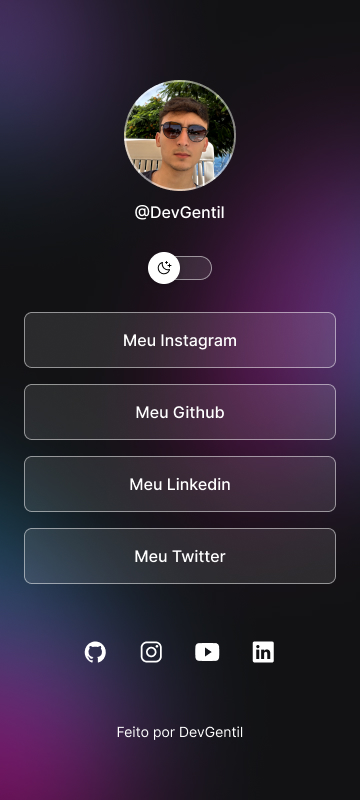

# MyLinks - Seu Hub de Redes Sociais Personalizado

  
  

## Descrição

O MyLinks é um projeto simples que permite a criação de um hub personalizado para suas redes sociais. Ele destaca uma abordagem minimalista e elegante, oferecendo suporte ao modo claro e escuro para se adequar às suas preferências.

## 🚀 Tecnologias

Esse projeto foi desenvolvido com as seguintes tecnologias:

- HTML
- CSS
- JavaScript
- Figma

## 💻 Projeto

O MyLinks é um agregador de links para usar como cartão de visitas online. Personalize com suas próprias fotos, links e informações de perfil.

Feito com ❤️ por [DevGentil](https://github.com/DevGentil).
